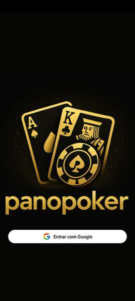
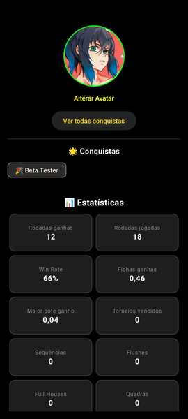
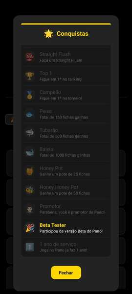
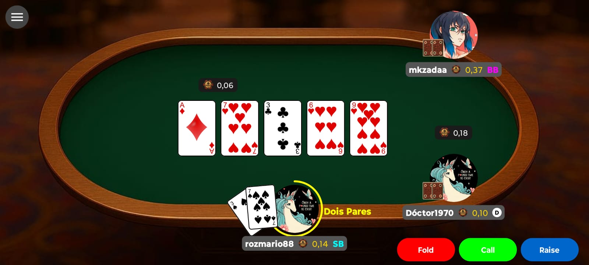

# PanoPoker

Desenvolvi o PanoPoker como um projeto fullstack completo para aplicar e consolidar habilidades-chave em back e frontend, comunicação em tempo real e integração com sistemas externos.

O sistema foi executado em produção real (VPS), com funcionalidades como controle de partidas multiplayer, timers sincronizados pelo servidor, lógica de turnos, gerenciamento de promotores e um app Android conectado via WebSocket. Apesar de estar atualmente offline, o projeto foi testado em uso real com sucesso no Linux com Nginx + CertBot.

---

## 🛠️ Tecnologias usadas

- **Backend:** FastAPI, SQLAlchemy, WebSocket
- **Frontend Android (Jogo):** Kotlin, Jetpack Compose
- **Frontend Web (Site e Paineis):** Jinja2, HTML, CSS, JS
- **Pagamentos:** Mercado Pago webhook  
- **Autenticação:** JWT, Google OAuth
- **Banco de dados:** PostgreSQL
- **Testes:** Pytest + Hypothesis

---

## 🔥 Features principais

- ✅ Controle de turnos com timers sincronizados por timestamp do servidor
- ✅ Comunicação real-time via WebSocket (sem delay)
- ✅ Backend em FastAPI com banco gerenciado via SQLAlchemy  
- ✅ Frontend Android moderno em Jetpack Compose
- ✅ Sistema de manutenção e controle de partidas 
- ✅ Integração com Mercado Pago (via webhook) 
- ✅ Showdown com exibição dos vencedores

---

## 🌐 Frontend Web

> O próprio backend também serve a pasta `/site`, que funciona como frontend web leve. Essa parte inclui:

- Página para download do app (.APK)
- Painel dos promotores com gestão de repasses e saldo
- Painel administrativo para controle das mesas, usuários e promotores

---

## 📸 Prints do projeto

### 🃏 App Android (Jetpack Compose)

 
 
 

### 💻 Paineis + Site do aplicativo

> *Imagens capturadas durante a fase de testes em produção real.*

---

## 🎯 Roadmap / Próximos passos

- Modo "PanoCoins" (jogar sem ser com real money)
- Motor do jogo BlackJack
- Chat em tempo real na mesa
- Adicionar equipes (clans)
- Adicionar sistema de VIPs

---

## 📫 Contato

LinkedIn: [seu-linkedin]
Portfólio: [portfolio]
GitHub: [https://www.github.com/d3v-mk]
