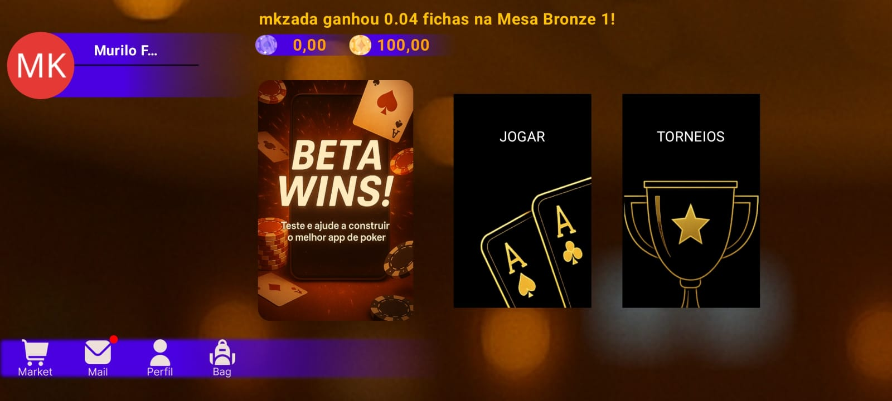
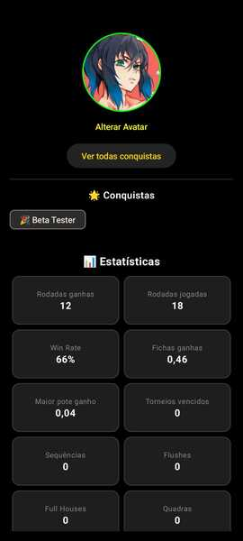
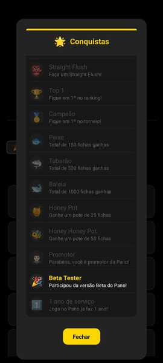
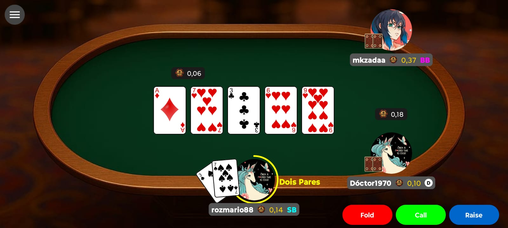

# PanoPoker

Desenvolvi o PanoPoker como um projeto fullstack completo para consolidar habilidades essenciais em backend, frontend, comunicação em tempo real e integração com sistemas externos.

O sistema rodou em produção real com domínio próprio (www.panopoker.com), incluindo controle de partidas multiplayer, timers sincronizados via servidor, lógica de turnos, gestão de promotores e um app Android conectado por WebSocket. Embora esteja offline no momento, foi testado com sucesso em ambiente Linux usando Nginx + CertBot.

> A documentação da VPS está em [`docs/setup_vps.md`](https://github.com/d3v-mk/backend/blob/main/docs/setup_vps.md)

---

## 🛠️ Tecnologias usadas

- **Backend:** Python, FastAPI, SQLAlchemy, WebSocket
- **Frontend Android (Jogo):** Kotlin, Jetpack Compose
- **Frontend Web (Site e Paineis):** Vite, TypeScript, React, Tailwind CSS
- **Pagamentos:** MercadoPago Webhook
- **Autenticação e Segurança:** JWT, Google OAuth
- **Banco de dados:** PostgreSQL
- **Testes:** Pytest + Hypothesis

---

## 🔥 Features principais

- Controle de turnos com timers sincronizados por timestamp do servidor
- Comunicação em tempo real via WebSocket (sem delay)
- Backend em FastAPI com banco gerenciado via SQLAlchemy
- Frontend Android moderno em Jetpack Compose
- Sistema de manutenção e controle de partidas
- Integração com APIs externas (Mercado Pago, Google)
- Showdown com exibição dos vencedores
- Perfil personalizado com estatísticas, upload de avatar e conquistas
- Avatares clicáveis nas mesas exibindo um dialog que mostra estatísticas do jogador

> 🔒 Todas as rotas sensíveis protegidas com JWT + checagem de escopo/autorização + CORS com origem restrita + bcrypt para senhas + variáveis de ambiente pra tudo sensível.

---

## 🌐 Frontend Web

> O próprio backend também serve a pasta `/site`, que funciona como frontend web leve.

Essa parte inclui:
- Site principal que serve o download do .APK
- Loja dos promotores
- Painel dos promotores com gestão de comissão e repasse
- Painel administrativo para controle das mesas, usuários e promotores
- Painel do desenvolvedor (permite conectar nas mesas via WebSocket, fazer ações, e etc..)

---

## 📸 Prints do projeto

### 🃏 App Android (Jetpack Compose)

  
  
  
  
  

> *Imagens capturadas durante a fase de testes em produção real.*

### 💻 Paineis + Site do aplicativo

### 🎥 Vídeo rápido de apresentação do app

- https://www.youtube.com/video-do-pano

---

## ⚙️ Rodando o projeto

A documentação de setup está em [`docs/setup.md`](https://github.com/d3v-mk/backend/blob/main/docs/setup.md)

Este guia inclui:
- 📦 Instalação dos requisitos
- 🧠 Criação do banco de dados e tabelas
- 🔑 Configuração de autenticação OAuth (Google e Mercado Pago)
- 🚀 Execução do backend (FastAPI + WebSocket)
- 🌐 Execução do site e painéis administrativos

> Tudo documentado e organizado para rodar localmente ou em produção.
---

## 🎯 Roadmap / Próximos passos

- Modo "PanoCoins" (Modo casual, focado na diversão)
- Motor do jogo BlackJack
- Chat em tempo real na mesa
- Adicionar equipes (clans)
- Adicionar sistema de VIPs

---

## 📫 Contato

- [LinkedIn](https://www.linkedin.com/in/SEU-LINK-AQUI)  
- [Portfólio](https://SEU-PORTFOLIO.com)  
- [GitHub](https://github.com/d3v-mk)

✨ Grateful to the universe ✨